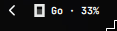
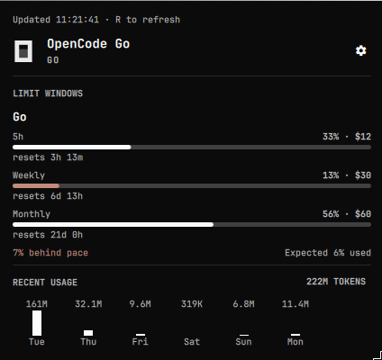
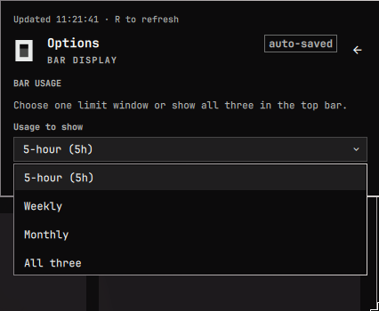

# OpenCode Go Usage

An Omarchy Quattro bar widget for OpenCode Go usage and recent token history.

## Install

```bash
omarchy plugin add ~/.config/omarchy/plugins/local.opencode-go --no-enable
# Add local.opencode-go to the right section when ready:
omarchy bar add local.opencode-go --section right
```

## Account

The widget reads the active key from `~/.local/share/opencode/auth.json` (`opencode-go` entry) and labels it `Go`.

## Limits and settings

The 5-hour rolling limit is $12, weekly is $30, and monthly is $60. Left click opens details; right/middle click refreshes; press `R` in the panel. Open the options button in the panel to choose whether the bar shows the 5-hour, weekly, monthly, or all three usage windows. The default refresh interval is five minutes and can be changed in the bar widget settings (60–3600 seconds).

## Screenshots







## Removal

```bash
omarchy bar remove local.opencode-go
omarchy plugin remove local.opencode-go --yes
```

## License

MIT.
